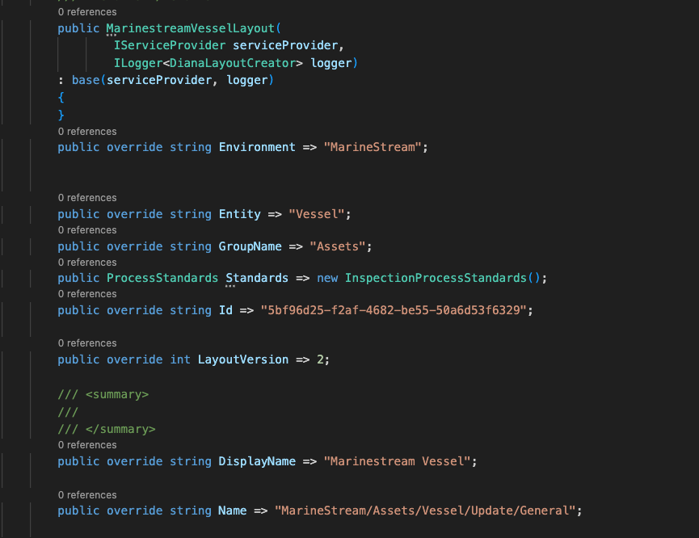
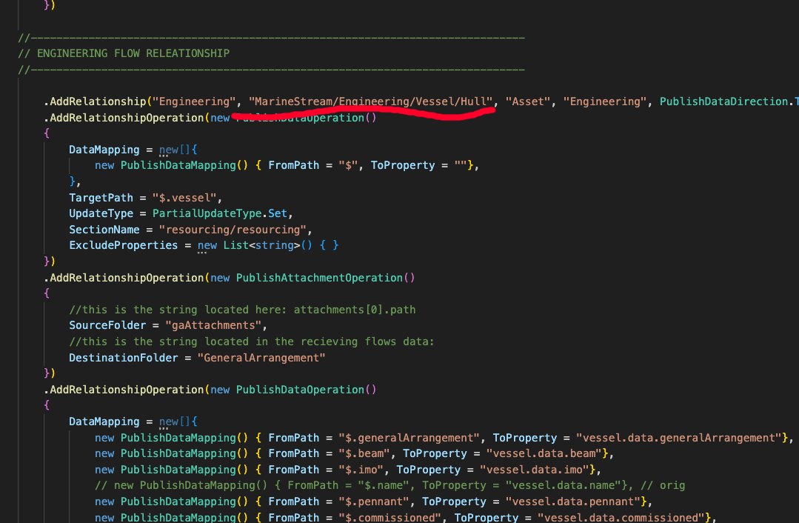
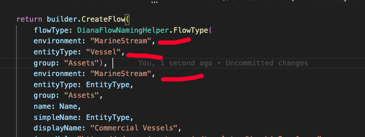
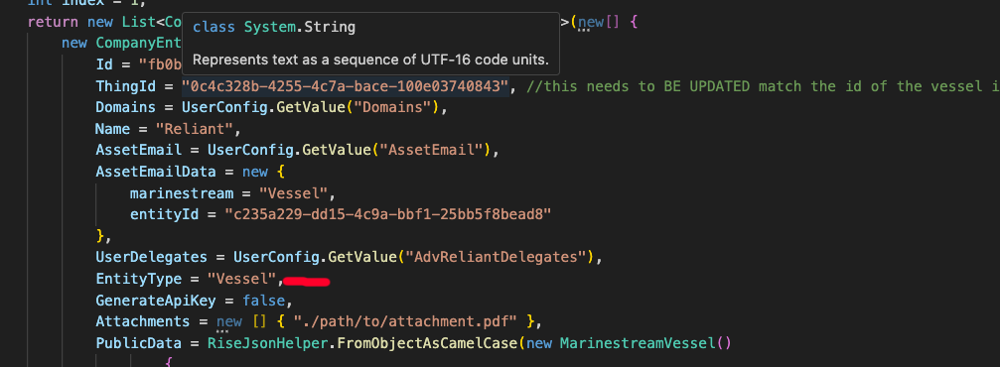

# String Search and Replace Tool Documentation

## Overview

This Command Line Interface (CLI) tool is designed to recursively search through specified file types (.cs and .csv) within a given directory and perform a series of string replacements based on a JSON configuration file. For .cs files, the tool searches for specific key-value pairs and replaces the value while keeping the key intact. For .csv files, the tool allows searching for a value without specifying a key by using "*" as the key in the configuration. Before making any modifications, the tool creates a backup of the entire directory by zipping it and saving it in a "TempBackUp" folder within the program directory. This document outlines the tool's functionality, usage guidelines, and its limitations.

## Features

- **Recursive Search:** Searches through all subdirectories within the specified directory.
- **File Type Filtering:** Only processes files with .cs or .csv extensions.
- **Key-Value Replacements:** Supports multiple search and replace operations based on key-value pairs defined in a JSON configuration file.
- **Wildcard Key for CSV:** Allows searching for a value without specifying a key in .csv files by using "*" as the key in the configuration.
- **Backup Creation:** Automatically generates a backup ZIP file of the entire directory before making any changes.

## Prerequisites

Before running the program, ensure that you have the following:

- .NET Core SDK installed on your machine. You can download it from the official .NET website: https://dotnet.microsoft.com/download
- A text editor or an Integrated Development Environment (IDE) to modify the JSON configuration file.

## Setup

1. Clone the repository or download the program files to your local machine.
2. Open a command prompt or terminal and navigate to the directory where the Program.cs file is located.

## Configuration

Create a JSON configuration file named `config.json` in the same directory as the Program.cs file. Open the `config.json` file in a text editor and define the search and replacement pairs using the following format:

```json
{
  "Replacements": [
    {
      "Key": "keyName1",
      "SearchValue": "oldValue1",
      "ReplacementValue": "newValue1"
    },
    {
      "Key": "keyName2",
      "SearchValue": "oldValue2",
      "ReplacementValue": "newValue2"
    },
    {
      "Key": "*",
      "SearchValue": "oldValue",
      "ReplacementValue": "newValue"
    }
  ]
}
```

# Search and Replace Tool

The `Replacements` array in the JSON configuration file can be expanded as needed to include additional search and replacement pairs. For .cs files, specify the `Key`, `SearchValue`, and `ReplacementValue` for each search and replacement pair. For .csv files, if you want to search for a value without specifying a key, set the `Key` to "\*" and provide the `SearchValue` and `ReplacementValue`. Save the `config.json` file.

## Use Case Specifics

The tool is designed to duplicate an ecosystem inside a single database collection. The backend logic iterates through the collection, looking for matching strings in order to render the UI correctly.

It's important to understand the stacking of abstraction:

- Layouts are referenced in flows.
- Flows are referenced in assets (entities - these terms are used interchangeably).
- Some of the backend logic relies on unique strings to connect the layout, flow, and assets JSON objects.

### Layouts



For layouts, the following changes are required:

- The Environment property needs to be changed.
- The Entity property needs to be changed.
- The Name property needs to be changed, specifically the first part before and including the /. For example, Marinestream/Assets/Vessel should be changed to MarinestreamQA/Assets/Vessel.

### Flows





For flows, ensure that the flows referenced in the `.AddRelationship` parameters are also correctly and predictably renamed.

Additionally, a flow needs to have all references to the environment and entity type changed predictably.

### Assets



For assets, either the asset name needs to be changed, or the reference to the flow needs to be changed if it's hardcoded.

## Usage

1. Open a command prompt or terminal and navigate to the directory where the Program.cs file is located.

2. Run the following command to execute the program:

  ```bash
  dotnet run "<directory-path>"
  ```

  Replace <directory-path> with the actual path to the directory you want to search and replace strings in. Make sure to wrap the path in double quotes if it contains spaces.

The program will create a backup of the directory in the "TempBackUp" folder within the program directory and then perform the search and replace operations on the specified file types. After the program finishes executing, it will display the path of the created backup ZIP file and the list of modified files.

## Limitations

- **File Type Restriction:** Only files with .cs or .csv extensions are processed. Other file types within the directory are ignored.
- **JSON Configuration:** The program relies on a properly formatted JSON configuration file named `config.json` to be present in the same directory as the Program.cs file. If the file is missing or improperly formatted, the program will not execute.
- **Backup Overwrite Risk:** If the program is run multiple times, newer backups will overwrite older ones in the "TempBackUp" folder without warning. Users should manually manage backups to prevent data loss.

## Best Practices

- **Backup Management:** Regularly clean up or move old backup files from the "TempBackUp" folder to avoid accumulating a large number of backups.
- **Configuration Review:** Double-check the search and replacement pairs defined in the `config.json` file before running the program to ensure accuracy.
- **Test Before Production Use:** Run the program on a copy of your target directory first to verify that it behaves as expected before using it on critical or production data.

## Conclusion

This CLI tool provides a convenient way to perform bulk search and replace operations on specific key-value pairs within .cs files and search for values without specifying a key in .csv files within a directory, while also creating a backup for safety. By following the provided setup and usage instructions, users can effectively utilize this tool in their development workflows.
